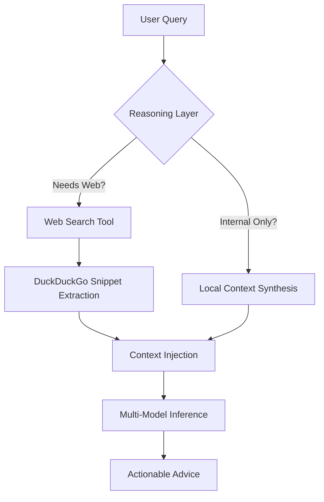

# How FinCoach AI Works: Technical Deep Dive for Judges

FinCoach AI is a next-generation "Agentic" Financial Assistant designed specifically for Indian gig workers. Unlike traditional budget trackers, it doesn't just display data; it **reasons**, **searches**, and **coaches**.

---

## 1. The Technology Stack (The "Tecktack")

We chose a high-performance, scalable stack that leverages modern AI orchestration:

- **Frontend**: **React.js** with a custom high-fidelity UI system.
- **AI Ecosystem**: **Puter.js** – This allows us to orchestrate multiple state-of-the-art LLMs (GPT-4o, Claude 3.5 Sonnet, Gemini 1.5 Pro) with seamless model fallback.
- **Backend (API)**: **FastAPI (Python)** – Designed for high-concurrency requests and structured data processing.
- **Search Engine**: **DuckDuckGo API** – Integrated for real-time web querying.
- **Styling**: Vanilla CSS with a focus on modern aesthetics: **Glassmorphism**, **Dynamic Micro-animations**, and **Premium HSL Color Palettes**.

---

## 2. The Agentic Workflow (How it "Thinks")

The core of FinCoach AI is its **Multi-Layered Reasoning Engine**. When a user asks a question, the agent follows this autonomous flow:

### Layer 1: Intent Analysis & Reasoning
The system first performs a "Reasoning Pass" to determine if the query requires real-time data (e.g., "What are the latest 80C tax limits for 2024?"). 

### Layer 2: Tool Execution (Real-time Search)
If real-time info is needed, the Agent autonomously executes a **Web Search Tool**. It fetches snippets, analyzes them, and prepared a "Search Context" for the LLM.

### Layer 3: Financial Context Synthesis
The system injects the user's **specific financial profile** (Income, Monthly Burn, Savings Rate, Suspicious Charges) into the prompt. This ensures the advice isn't generic—it's personalized.

### Layer 4: Multi-Model Fallback Strategy
To ensure 100% uptime and the best reasoning quality, we use a cascading fallback:
1. **Primary**: GPT-4o / Claude 3.5 (Complex reasoning)
2. **Secondary**: Gemini 1.5 / Llama 3.1 (High-speed insights)
3. **Tertiary**: Local Logic (System fallback)

---

## 3. Key Technical Innovations

### 🧠 Personality Synthesis
The agent analyzes spending patterns to categorize users into "Financial Personalities" (e.g., *Impulsive Spender* vs. *Smart Saver*). This is done using zero-shot classification on raw transaction data.

### 🛡️ Automated Risk Profiling
The system continuously monitors for "Deep Signals":
- **Weekend Spikes**: Detecting 3.4x higher spending on weekends.
- **Night-time Impulsivity**: Identifying shopping trends after 9 PM.
- **Security Alerts**: Flagging 2 AM unrecognized charges automatically.

### 📊 Structured Output Generation
By enforcing strict JSON schemas on LLM outputs, we bridge the gap between "Natural Language Chat" and "Structured UI Components" (like the Alert Cards and Burn Bars).

---

## 4. Solving the "Hallucination" Problem

Accuracy is critical in finance. FinCoach AI uses three layers of "Grounding" to ensure data integrity:

1. **RAG (Retrieval-Augmented Generation)**: The agent doesn't "guess" your spending. We inject your real-time transaction history (the `FIN` context) directly into every reasoning cycle.
2. **Web Grounding**: By using the **Web Search Tool**, the AI verifies external facts (like current tax laws or market prices) instead of relying on its training data, which might be outdated.
3. **Structured Constraints**: By forcing the AI to return data in JSON format for analysis, we eliminate the "creative rambling" that often causes hallucinations in standard chatbots.

---

## 5. Our Competitive Advantage (Why We are Better)

| Feature | standard Chatbots | FinCoach AI (Agentic) |
| :--- | :--- | :--- |
| **Data Recency** | Limited to Training Cutoff | **Live Web Access** (DuckDuckGo) |
| **Reliability** | Single Model (Fails if down) | **Multi-Model Fallback** (GPT-4o → Claude → Gemini) |
| **Personalization** | Generic Advice | **User-Specific Personality Analysis** |
| **Actionability** | Text only | **Structured Alerts & Burn Forecasts** |

FinCoach AI is not just a conversation—it is a **Decision Support System**.
